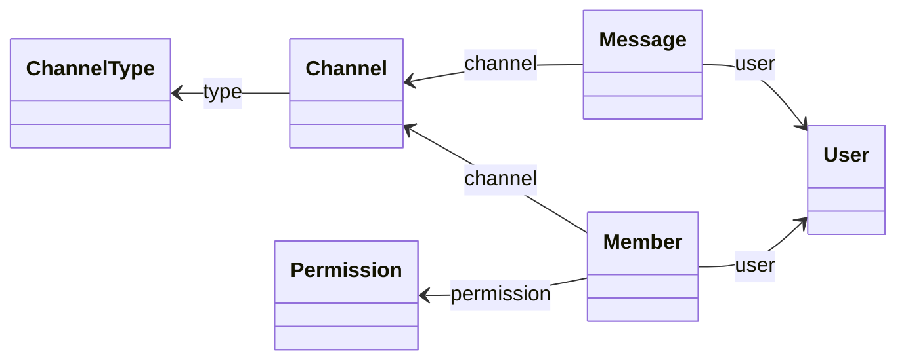
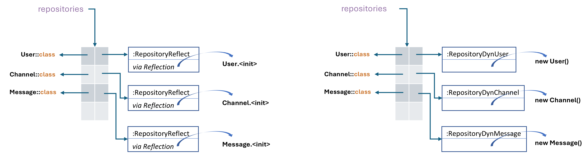

# jdbcRepo

Automatic implementation of a `Repository` interface for a given _domain object_.

## Github Classrooms for submission (**groups of 3 students**):

* i41d - https://classroom.github.com/a/rgXxQMNw
* i42d - https://classroom.github.com/a/S81A4PRI
* i43d - https://classroom.github.com/a/T4Dpgvhr
* i44d - https://classroom.github.com/a/6Dl1CfG4
* i41n - https://classroom.github.com/a/oALcsFpm

## Assignments

**Deadlines**:
* [Part 1](#assignment-1---jdbcrepolib-with-kotlin-reflection) - **April 7**
* [Part 2](#assignment-2---dynamic-generation-of-bytecode) - **May 5**
* [Part 3](#assignment-3) - **May 26**

## Scope

This library provides an automatic implementation of a `Repository`
interface for a given _domain object_, inspired by the _repository
pattern_ used in Spring Data JPA.
The _repository pattern_ [definition by Martin Fowler](https://martinfowler.com/eaaCatalog/repository.html)
states: 

> Mediates between the _domain_ and _data_ mapping layers using a
> collection-like interface for accessing _domain objects_

```kotlin
interface Repository<K, T> {
    fun getById(id: K): T? // Find an entity by its ID

    fun getAll(): List<T> // Retrieve all entities

    fun update(entity: T) // Update an existing entity

    fun deleteById(id: K) // Delete an entity by its ID
}
```


The **jdbcRepo** has some limitations and only supports a domain model design
with the following constraints:
* Support for SQL insert operations will be implemented in the second part of
  the assignment through the dynamic generation of bytecode.
* Only supports associations with **single multiplicity**.
  This means that properties **cannot** use data structures like
  `List`, `Collection`, `Iterable`, etc., to hold multiple items.
* The object graph should not contain cyclic references. For example, 
  a domain class cannot have a property of the same type as its owning class.
  
**Example** of a supported domain model:


## Assignment 1 - jdbcRepoLib with Kotlin Reflection

### 1.1. - Implement `RepositoryReflect`

Provide an implementation of the `RepositoryReflect` class in the `jdbcRepoLib`
module using the **Kotlin Reflection API**.  

The unit tests in the `jdbcRepoLib` module use a PostgreSQL database running in
a Docker container. The Docker setup and database initialization scripts are
located in the `/src/test/docker` and `/src/test/sql` directories, respectively.  
The `test` task in `build.gradle` is configured to automatically start the
Docker container before running the unit tests and stop it afterward.  
To run the unit tests, you must install [Docker
Desktop](https://www.docker.com/products/docker-desktop/).

Your implementation should be developed incrementally, addressing the
requirements of each of the following unit tests:  

1. `UserRepositoryTest` – Supports entities without associations and no enum type handling.  
2. `ChannelRepositoryTest` – Adds support for enum types.  
3. `MessageRepositoryTest` – Introduces support for associations.

You may use the ad-hoc implementation of `ChannelRepositoryJdbc` in the
`chatDomainModel` module as a reference for implementing `RepositoryReflect`.

### 1.2 - Micro-benchmarking

Run the micro-benchmarking from `jdbcRepoMicrobench` and register the slowdown 
of the `RepositoryReflect` implementation compared to the ad-hoc `ChannelRepositoryJdbc`.

Below is an example of the expected slowdown, approximately 3×, in the
`RepositoryReflect` implementation when retrieving all channels using an
in-memory mock JDBC implementation with five `Channel` instances.

```
Benchmark                             Mode  Cnt     Score     Error  Units
benchRepositoryJdbcGetAllChannels     avgt    4   938.291 ±  29.267  ns/op
benchRepositoryReflectGetAllChannels  avgt    4  3143.358 ± 904.489  ns/op
```

**NOTE:** Before proceeding, ensure that the unit tests of `jdbcRepoMicrobench` pass without errors.

To run the benchmark on you local machine just run:

```
./gradlew jmhJar
```

And then:

```
java -jar jdbcRepoMicrobench/build/libs/jdbcRepoMicrobench-jmh.jar -i 4 -wi 4 -f 1 -r 2 -w 2
```

* `-i`  4 iterations
* `-wi` 4 warmup iterations
* `-f`  1 fork
* `-r`  2 run each iteration for 2 seconds
* `-w`  2 run each warmup iteration for 2 seconds.

### 1.3 - New domain model 

Create your own example of a domain model and a corresponding PostgreSQL
database in `src/test/sql` within the `jdbcRepoLib` module. Then, write unit
tests to verify the correctness of your `RepositoryReflect` implementation using
this domain.  

Your domain should include at least two associations and two enum types. You may
base it on the domain model specified by one of your group members in the first
assignment of **Jsonoy**.

## Assignment 2 - Dynamic generation of bytecode

Following up on Assignment 1 developed in the **jdbcRepo** library, it is
intended to complete the implementation of the `buildRepositoryByteArray()` in
`RepositoryDynamic.kt` file which makes a dynamic implementation of a class
implementing the interface `Repository`, but that **DOES NOT use reflection** to
**instantiate the domain class** (e.g. `User`, `Channel`, etc).

**NOTE** that reflection will continue to be used to read metadata, only ceasing
to be used in operations such as `ctor.callBy(...)`. The instantiation of a
domain class will now be done directly based on code generated at runtime
through the
[Class-File API](https://docs.oracle.com/en/java/javase/22/vm/class-file-api.html).

**NOTE you will need JDK 22 to use the Class-File API.**

The following Figure presents an example of the use of `RepositoryReflect` from
Assignment 1, where each instance of `RepositoryReflect` is associated with an
instance of `KClass` to manage a specific domain class.
Now, in Assignment 2, you will have a different Repository class (e.g.,
`RepositoryDynUser`, `RepositoryDynChannel`, etc.) for each domain class, rather
than using the same type of Repository to manage all classes (i.e.
`RepositoryReflect`).
These repositories are generated at runtime (i.e., dynamically) with the support
of the Class-File API.



For each domain entity class the `loadDynamicRepository()` creates a specific
implementation of a new class named `RepositoryDyn<Entity Name>`, e.g.
`RepositoryDynChannel`.

Each of these classes inherits from `RepositoryReflect` and simply overrides
the method responsible for mapping a `ResultSet` into an entity object—such
as `Channel`, `Message`, or others—specifically the
`open fun mapRowToEntity(rs: ResultSet): T` method. To that end, **ENSURE** the following:
1. The `RepositoryReflect` class is marked as `open`.
2. The method `mapRowToEntity`, or its equivalent, is declared as `open`.
3. The `connection` property is declared as `protected`.


### 2.0 - Configure the project for Java 22

Update your `jdbcRepo` project to match the configurations introduced in
[commit 3cb3b53](https://github.com/isel-leic-ave/jdbcRepo/commit/3cb3b534b50fad5168c5e1ca485828bbcc3cdc9b),
ensuring support for Java 22 and the new Class-File API.
This includes updating the following files:
* `gradle-wrapper.properties`
* `build.gradle` in each module (**IGNORE the modification of docker path**)

**After making these changes, verify that the project still builds successfully
by running `./gradlew build`.**

### 2.1 - Generate mapping ResultSet to Entity T dynamically

Your implementation should be developed incrementally, fulfilling the requirements of each step **without skipping any**.

**Create a separate commit for each of the following changes, and include the requirement order number in the commit message.**

1. Update the `UserRepositoryTest` to support different implementations of the
   `Repository` interface, following the changes introduced in 
   [commit 6726b03](https://github.com/isel-leic-ave/jdbcRepo/commit/6726b032920a1bfd2d99de2810119d0be3c0dc29).  
   Add the following dependency to enable parameterized tests:  
   `testImplementation("org.junit.jupiter:junit-jupiter-params:5.10.2")`.  
   **After making these changes, verify that the project still builds and tests
   are passing successfully**

2. Copy the [`RepositoryDynamic`](https://github.com/isel-leic-ave/jdbcRepo/blob/main/jdbcRepoLib/src/main/kotlin/pt/isel/RepositoryDynamic.kt)
   file into your project. **Review its structure and carefully analyze
   each of its functions.**
   **Add Javadoc comments to each member** of the `RepositoryDynamic` file,
   clearly explaining its behavior and purpose.

3. Implement the `buildRepositoryByteArray()` function:
   1. This function generates a byte array representing a dynamically created
      class that extends `RepositoryReflect`, and then saves it to the
      corresponding class file.
   2. Ensure that the `RepositoryReflect` class is marked as `open`.
   3. The dynamically created class must have a constructor that matches the
      base class constructor and calls the base constructor with the required
      arguments.
   4. **Do not override any methods** in this step.
   5. In `UserRepositoryTest` add an instance of `Repository<Long, User>`,
      created using `loadDynamicRepo(connection, User::class)`, to the
      repositories returned by the `repositories()` function.
   6. Verify that all tests pass and confirm that the `RepositoryDynUser.class`
      file has been created. Open the resulting class file in IntelliJ and check
      the decompiled code.

4. Override the `mapRowToEntity` method in the dynamically generated class, or
   any other method responsible for mapping a `ResultSet` into an instance of
   the entity class `T`.  
   **Note:** Ensure the base method in `RepositoryReflect` is declared as
   `open`.  
   In this step, handle **only properties whose types are primitives, `String`,
   or `java.sql.Date`**.
   After overriding, verify that `UserRepositoryTest` still passes.

5. Update `ChannelRepositoryTest` to use a parameterized test, as in step 1,
   covering both reflective and dynamic repository implementations.  
   Ensure that the overridden `mapRowToEntity` method correctly handles
   properties of enum types.  
   Confirm that the `RepositoryDynChannel.class` file has been created.  
   Open the resulting class file in IntelliJ and check the decompiled code.

6. Update `MessageRepositoryTest` to use a parameterized test, as in step 1,
   covering both reflective and dynamic repository implementations.  
   Ensure that the overridden `mapRowToEntity` method correctly supports
   associations between domain classes.
   **Remember, we need access to the `connection` property to be passed to the
   auxiliary instance of the repository.**
   Confirm that the `RepositoryDynMessage.class` file has been created.  
   Open the resulting class file in IntelliJ and check the decompiled code.

7. Update your tests from part 1.3 of Assignment 1 to use parameterized tests,
   following the pattern from step 1.  
   Make sure to cover both reflective and dynamic repository implementations,
   and verify that all tests pass.


### 2.2 - Micro-benchmarking

Update the `jdbcRepoMicrobench` module to include performance measurements for a
dynamically generated repository.

**Verify if its performance is similar to the baseline.**

### 2.3 - Micro-benchmarking for entities with associations

Implement a performance test for an entity from your domain in part 1.3 of
Assignment 1 that maintains associations with other entities.

Modify `FakePreparedStatement` and `FakeResultSet` to support this test.

Compare the performance across the three approaches: baseline, reflective, and
dynamic.

**OPTIONAL**: Improve the performance of the dynamic repository by adding
instance fields that hold instances of auxiliary repositories for related
entities.

### 2.4 - Support Insert (OPTIONAL)

Add support for the SQL `INSERT` statement. To achieve this, create an interface
extending `Repository` and define an `insert` method annotated with `@Insert`.
This method should be implemented dynamically.

The updated `loadDynamicRepo` should return an instance of a dynamically created
class that extends `RepositoryReflect` and implements the given interface, e.g.:
`UserRepository`:

```kotlin
val repo: UserRepository = loadDynamicRepo(connection, User::class, UserRepository::class)

interface UserRepository : Repository<Long, User> {
    @Insert
    fun insert(
        name: String,
        email: String,
        birthdate: Date,
    ): User
}
```

### 2.5 - Fully dynamic Repository (OPTIONAL)

Create a new implementation of `buildRepositoryByteArray()` that generates a new
class from scratch. This class should **not** inherit from `RepositoryReflect`,
but instead provide dynamic implementations of methods, replacing reflection.

Note: You do not need to implement all methods dynamically. You may use an
auxiliary abstract base class that provides the skeleton for the main methods
(e.g., `update`, `delete`, etc.). Delegate the implementation of the specific
methods to hook methods (abstract methods) that will be implemented dynamically
by the derived class.

## Assignment 3

In this assignment, you should update the repository implementation to support
building and executing **lazy SQL queries** through the new `findAll()` method
of the `Repository` interface:

```kotlin
interface Repository<K, T> {
    ...

    fun findAll(): Queryable<T>
}
```

To achieve this, allow query clauses to be added incrementally, producing **new
query objects** based on existing ones. The actual SQL execution should only
happen when the result is iterated.

In the following example, note two important aspects:

* You can add additional clauses to an existing query, which **produces a new
  query**.
* The SQL statement is **only executed when you start iterating** over the result
  (e.g., using `forEach`). At that moment, the query will reflect any changes
  made to the database in the meantime, such as newly inserted entries.


```kotlin
val repository: Repository<String, Channel> = ...
val channelsPublicAndReadOnly =
      repository
         .findAll()
         .whereEquals(Channel::type, ChannelType.PUBLIC)
         .whereEquals(Channel::isReadOnly, true)
         .iterator()

// Insert a new public and read-only channel before iterating over the result
ChannelRepositoryJdbc(connection).insert(
   Channel("Surf", ChannelType.PUBLIC, System.currentTimeMillis(), false, 400, 50, true, 0L),
)

// The newly inserted channel will appear during iteration, even though the query was defined earlier
assertEquals("Support", channelsPublicAndReadOnly.next().name)
assertEquals("Surf", channelsPublicAndReadOnly.next().name)
assertFalse { channelsPublicAndReadOnly.hasNext() }
```

This new behavior is defined by the `Queryable` interface shown in the following
listing.  
**Note** that `whereEquals` and `orderBy` can be chained in any order to
build a new query.  
Also note that `Queryable` implements the `Sequence` interface.
["_Unlike collections, sequences don't contain elements, they produce them while
iterating._"](https://kotlinlang.org/docs/sequences.html)

```kotlin
interface Queryable<T> : Sequence<T> {
    fun <V> whereEquals(prop: KProperty1<T, V>, value: V): Queryable<T>

    fun <V> orderBy(prop: KProperty1<T, V>): Queryable<T>
}
```

The `findAll()` implementation should be provided in `RepositoryReflect`, making
it available to any subclass and ensuring consistent behavior in dynamically
generated repositories as well.

The method should be implemented following the approach below, where all
query-building logic is encapsulated in an auxiliary class named
`QueryableBuilder`, which you must implement as part of this assignment.

Note that `RepositoryReflect` should provide to the `QueryableBuilder` any
information necessary to support this functionality, such as metadata or helper
functions.

**You must also implement unit tests to verify the correct behavior of
`whereEquals` and `orderBy`, including their lazy evaluation semantics.**

You should ensure that closeable resources, such as `PreparedStatement` and
`ResultSet`, are automatically closed when iteration over the returned result
reaches the end.

```kotlin
open class RepositoryReflect<K : Any, T : Any>(
    protected val connection: Connection,
    private val domainKlass: KClass<T>,
) : Repository<K, T> {
    ...
    override fun findAll(): Queryable<T> {
        val sql = "SELECT ... FROM ..."
        return QueryableBuilder(connection, sql, properties, ::mapRowToEntity)
    }
}
```
