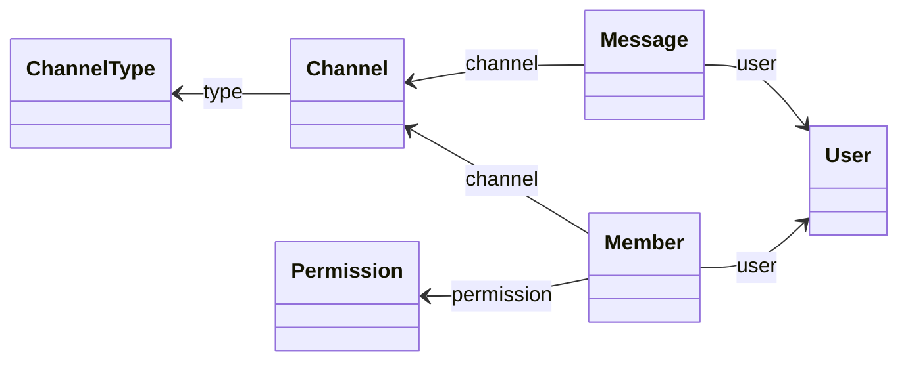

# jdbcRepo

Automatic implementation of a `Repository` interface for a given _domain object_.

## Assignments

**Deadlines**:
* Part 1 - **April 7**
* Part 2 - **May 5**
* Part 3 - **May 26**

## Scope

This library provides an automatic implementation of a `Repository`
interface for a given _domain object_, inspired by the _repository
pattern_ used in Spring Data JPA.
The _repository pattern_ [definition by Martin Fowler](https://martinfowler.com/eaaCatalog/repository.html)
states: 

> Mediates between the _domain_ and _data_ mapping layers using a
> collection-like interface for accessing _domain objects_

```kotlin
interface Repository<K, T> {
    fun getById(id: K): T? // Find an entity by its ID

    fun getAll(): List<T> // Retrieve all entities

    fun update(entity: T) // Update an existing entity

    fun deleteById(id: K) // Delete an entity by its ID
}
```


The **jdbcRepo** has some limitations and only supports a domain model design
with the following constraints:
* Support for SQL insert operations will be implemented in the second part of
  the assignment through the dynamic generation of bytecode.
* Only supports associations with **single multiplicity**.
  This means that properties **cannot** use data structures like
  `List`, `Collection`, `Iterable`, etc., to hold multiple items.
* The object graph should not contain cyclic references. For example, 
  a domain class cannot have a property of the same type as its owning class.
  
**Example** of a supported domain model:


## Part 1 - jdbcRepoLib with Kotlin Reflection

### 1.1. - Implement `RepositoryReflect`

Provide an implementation of the `RepositoryReflect` class in the `jdbcRepoLib`
module using the **Kotlin Reflection API**.  

The unit tests in the `jdbcRepoLib` module use a PostgreSQL database running in
a Docker container. The Docker setup and database initialization scripts are
located in the `/src/test/docker` and `/src/test/sql` directories, respectively.  
The `test` task in `build.gradle` is configured to automatically start the
Docker container before running the unit tests and stop it afterward.  
To run the unit tests, you must install [Docker
Desktop](https://www.docker.com/products/docker-desktop/).

Your implementation should be developed incrementally, addressing the
requirements of each of the following unit tests:  

1. `UserRepositoryTest` – Supports entities without associations and no enum type handling.  
2. `ChannelRepositoryTest` – Adds support for enum types.  
3. `MessageRepositoryTest` – Introduces support for associations.

You may use the ad-hoc implementation of `ChannelRepositoryJdbc` in the
`chatDomainModel` module as a reference for implementing `RepositoryReflect`.

### 1.2 - Micro-benchmarking

Run the micro-benchmarking from `jdbcRepoMicrobench` and register the slowdown 
of the `RepositoryReflect` implementation compared to the ad-hoc `ChannelRepositoryJdbc`.

**NOTE:** Before proceeding, ensure that the unit tests of `jdbcRepoMicrobench` pass without errors.

To run the benchmark on you local machine just run:

```
./gradlew jmhJar
```

And then:

```
java -jar jdbcRepoMicrobench/build/libs/jdbcRepoMicrobench-jmh.jar -i 4 -wi 4 -f 1 -r 2 -w 2
```

* `-i`  4 iterations
* `-wi` 4 warmup iterations
* `-f`  1 fork
* `-r`  2 run each iteration for 2 seconds
* `-w`  2 run each warmup iteration for 2 seconds.

### 1.3 - New domain model 

Create your own example of a domain model and a corresponding PostgreSQL
database in `src/test/sql` within the `jdbcRepoLib` module. Then, write unit
tests to verify the correctness of your `RepositoryReflect` implementation using
this domain.  

Your domain should include at least two associations and two enum types. You may
base it on the domain model specified by one of your group members in the first
assignment of **Jsonoy**.

## Part 2 - Dynamic generation of bytecode

Implement `repositoryDynamicBuilder()` in the `jdbcRepoLib` module to
dynamically create a class that implements the `Repository` interface.

Add support for SQL `INSERT` statement. To achieve this, an interface extending
`Repository` may define an `insert` method annotated with `@Insert`, which will
be implemented dynamically.

(... in progress...)

## Part 3

Add support for Lazy queries.

`findAll().whereEquals(<col>, <value>).sortedBy(<col>).distinctBy(<col>)`

(... in progress...)
